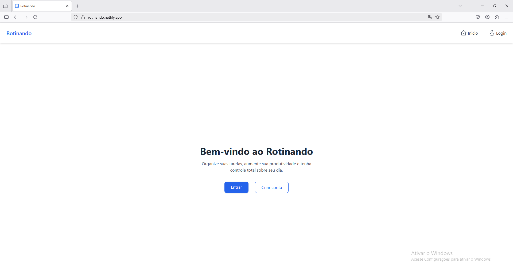
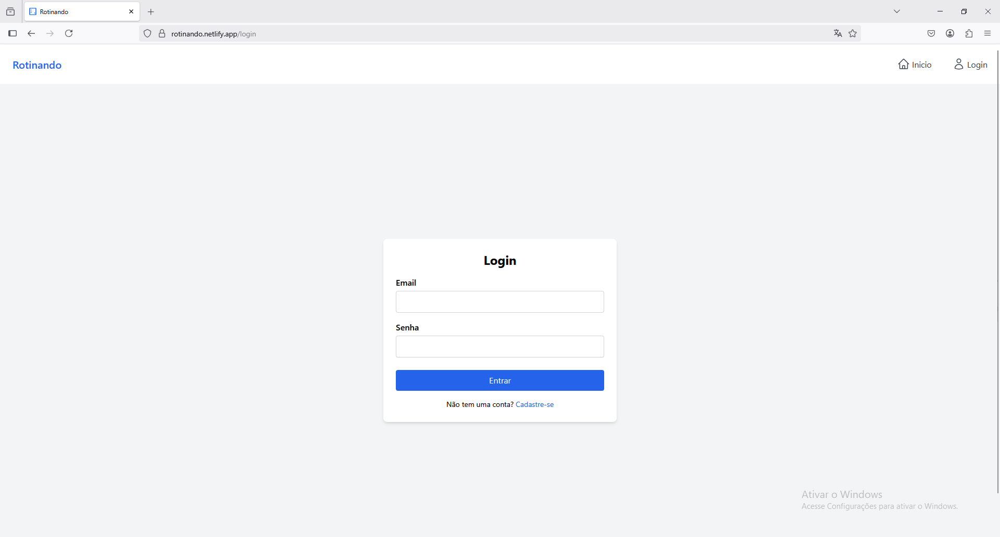

📝 #Task Manager — Frontend

Este é o frontend do projeto Task Manager, uma aplicação web para gerenciamento de tarefas com autenticação. Desenvolvido em React com estilização utilizando Tailwind CSS.

#Funcionalidades
✅ Autenticação de Usuário: Sistema seguro de login e registro
✅ Painel de Controle (Dashboard): Visão geral de todas as tarefas com indicadores de status
✅ Gerenciamento de Tarefas: Criar, editar, excluir e marcar tarefas como concluídas
✅ Design Responsivo: Funciona perfeitamente em dispositivos desktop e móveis
✅ Rotas Privadas: Rotas protegidas que exigem autenticação
✅ Consumo de API RESTful desenvolvida em Node.js(Task Manager API)

🚀 Tecnologias utilizadas

Frontend: React, React Router

Estilização: CSS/Tailwind CSS

Gerenciamento de Estado: React Context API(Em desenvolvimento)

Autenticação: Autenticação baseada em token JWT

📂 Estrutura de pastas

```bash
src/
├── assets/           # Ícones personalizados
│   └── abaIcon.svg
│   └── icons.svg
├── components/       # Componentes reutilizáveis (Navbar, etc)
│   ├── navbar.jsx
│   ├── privateRoutes.jsx
│   └── taskCard.jsx
├── pages/  # Páginas principais (Home, Login, Register, Dashboard)
│   ├── dashboard.jsx
│   ├── home.jsx
│   ├── login.jsx
│   └── register.jsx
├── routes/ # Rotas
│   ├── routes.jsx
├── App.jsx
└── main.jsx
```

⚙️ Como rodar localmente

1. Clone o repositório:

```bash
git clone https://github.com/seu-usuario/task-manager-frontend.git
cd task-manager-frontend
```

2. Instale as dependências:

```bash
npm install
```

3. Rode a aplicação:

```bash
 npm run dev
```

4. Acesse no navegador:

```bash
http://localhost:5173
```

⚙️ *Como Usar*

1. Registre uma nova conta ou faça login com credenciais existentes

2. Vá até o painel para visualizar e gerenciar suas tarefas

3. Crie novas tarefas preenchendo o formulário de tarefa

4. Edite ou exclua tarefas usando os controles em cada cartão de tarefa

5. Marque as tarefas como concluídas clicando na caixa de seleção

📝 *Capturas de Tela*

Página Inicial

 

Página de Login



Painel de Registro


⚠️ Certifique-se de que a API backend está rodando em http://localhost:5000 (ou atualize os endpoints no código).

🔐 Ambiente

No momento, os tokens são armazenados via localStorage. Futuramente você pode considerar o uso de Context API ou Redux para gerenciamento global de estado e autenticação.

💡 Melhorias futuras

-Marcar como concluída
-Filtro por status (pendente, concluída)
-Categorias de tarefas representadas por cores distintas

✍️ Autor

Felipe — Desenvolvedor frontend 💻
